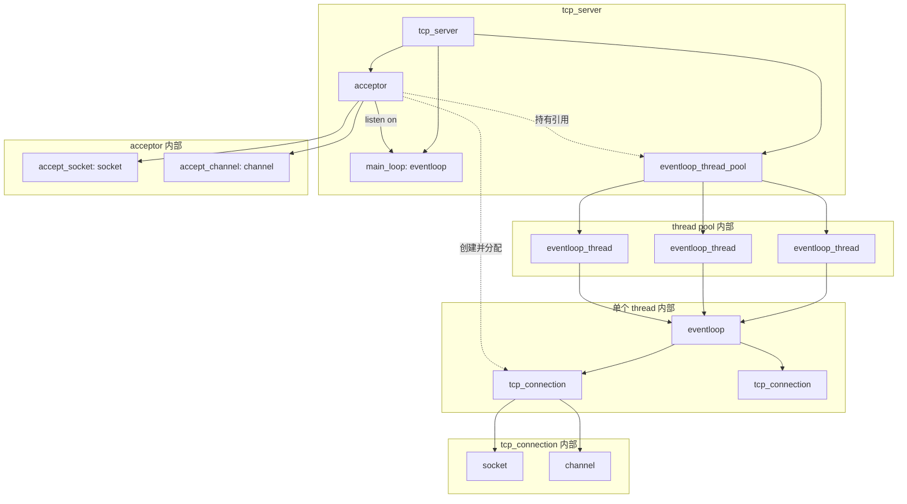
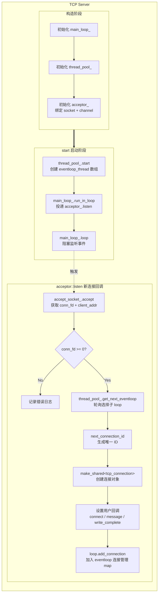
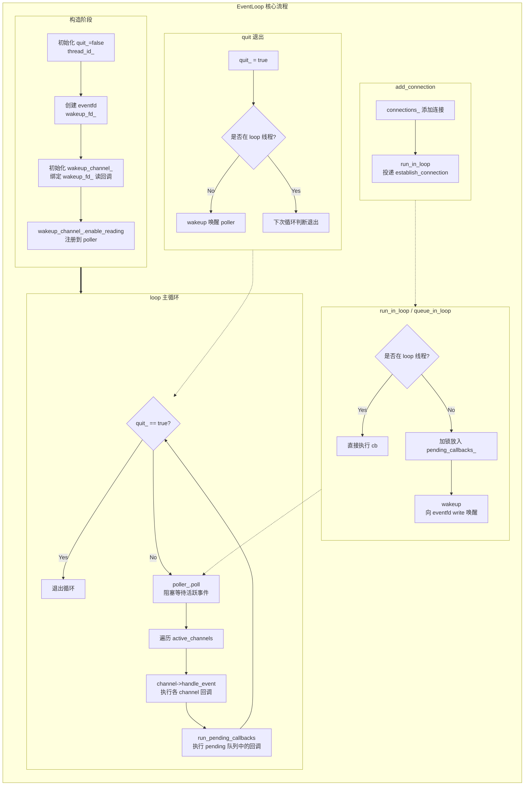
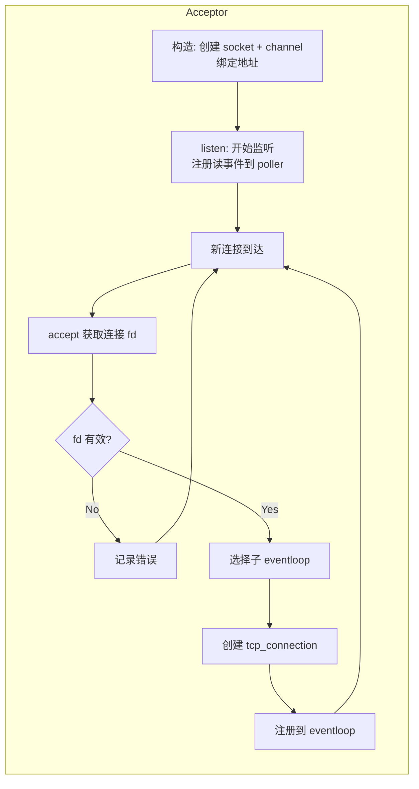
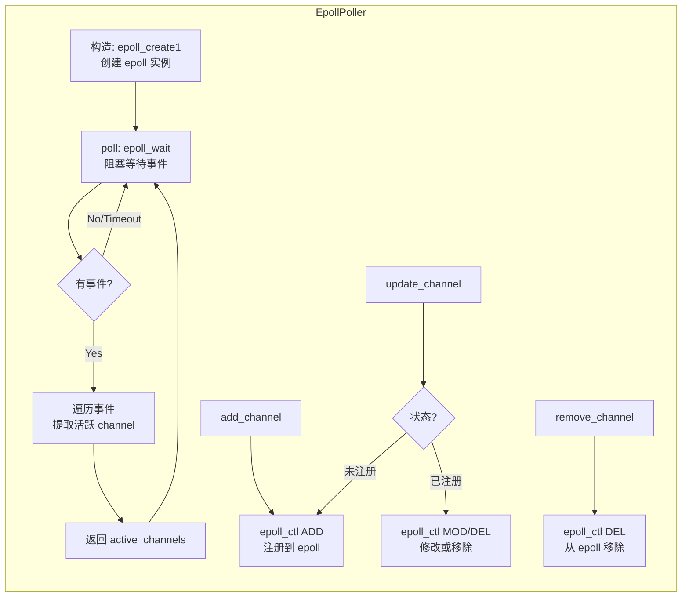
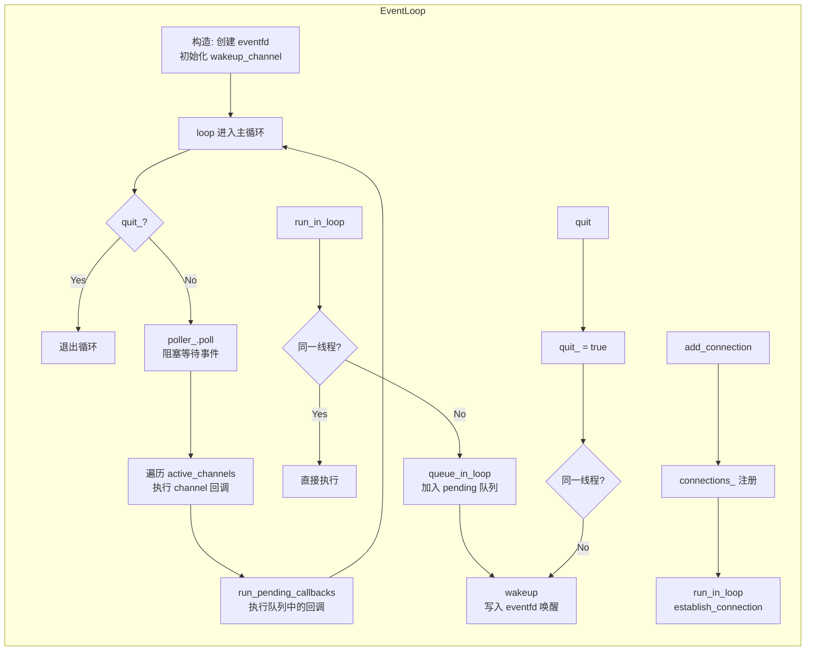

# 架构

## 架构

### tcp_server

### eventloop_thread_pool

### acceptor

### epoller

## eventloop

## 问题

### 客户端发送了数据，服务端建立连接成功，但是没有处理数据，同一个事件不断就绪

不同事件的 “处理完成” 标准：
1. 读事件 EPOLLIN：处理完成 = 把缓冲区数据全部读完，读完后，内核缓冲区空了 → 不再就绪，LT 模式（默认模式）下就不会再触发了
2. 写事件 EPOLLOUT：只要发送缓冲区不满，就一直就绪！一旦监听 EPOLLOUT，epoll_wait 会立刻、连续、疯狂返回，必须写完数据后，立刻删除 EPOLLOUT 监听
